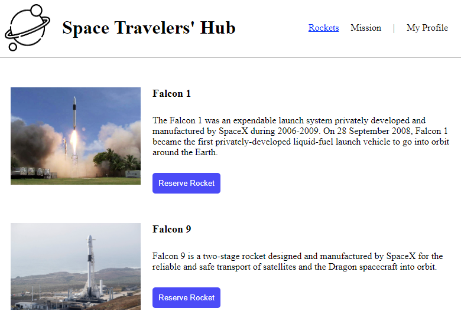
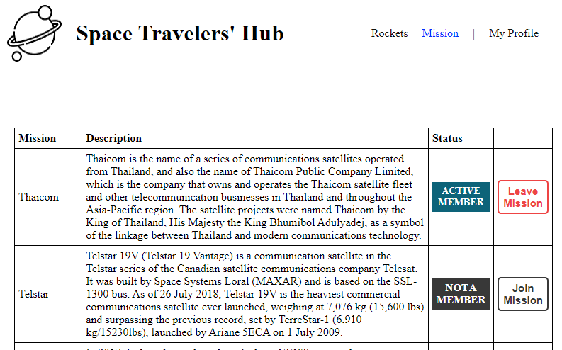

## Live Demo

> [Live Demo](https://space-travellers-app-hub.netlify.app/)

## vide Demo

> [Video Demo](https://drive.google.com/file/d/1M_Vd6bGCrfJu3IzBGFTtwJeqVHlkD1Us/view?usp=sharing)

## Description

> The Space Travelers hub is an application that allows adventurers to make custom reservations of rockets and dragons for space travel. Also, users have an opportunity to select a mission of their choice.

 
> <h2 align="center">
  Demo 📝
</h2>

|                                                       **Interface 1**                                                       |
| :-------------------------------------------------------------------------------------------------------------------------: |
| 

|                                                       **Interface 2**                                                       |
| :-------------------------------------------------------------------------------------------------------------------------: |
|  
> Learning objectives: 

- Use React components.
- Use React props.
- Use React Router.
- Connect React and Redux.
- Handle events in a React app.
- Write unit tests with React Testing Library.
- Use styles in a React app.
- Use React life cycle methods.
- Apply React best practices and language style guides in code.
- Use store, actions and reducers in React.
- Perform a code review for a team member.

- ## Built With

- React
- Redux
- JSX
- jest 
- ES6 

## Getting Started

To get a local copy up and running follow these simple example steps.
1. Download the `Zip` or `(git clone)[https://github.com/ericmahare/space-travellers-hub.git]`
2. `cd space-travellers-hub`
3. Then open in your browser by using `live server`\

**Install**

- On your terminal run : `npm i`
- To start the development server : `npm run start`
- In case you run into any errors please raise an [issue](https://github.com/ericmahare/space-travellers-hub/issues).
## Test

For tracking linter errors locally you need to follow these steps:

- After cloning the project you need to run this command
  > npm install
   `This command will download all the dependencies of the project`

- For tracking the linter errors in CSS file run:
  > npx stylelint "**/*.{css,scss}"

- And For tracking the linter errors in React files run:
  > npx eslint .

## Authors

👥 **ADISA Hammed**

- GitHub: [@AbuRayhaan](https://github.com/AbuRayhaan)
- Twitter: [@ayinla2011](https://twitter.com/Ayinla2011)
- LinkedIn: [Hammed Adisa](https://www.linkedin.com/in/hammed-adisa-)

👤 **Eric Mahare**

- GitHub: [@erikmahare](https://github.com/ericmahare) 
- Twitter: [@erikmahare](https://twitter.com/erikmahare) 
- LinkedIn: [Eric Mahare](https://www.linkedin.com/in/eric-mahare-358944183/) 
## 🤝 Contributing

Contributions, issues, and feature requests are welcome!

Feel free to check the [issues page](../../issues/).

## Show your support

Give a ⭐️ if you like this project!

## Acknowledgments
- [Rocket API](https://api.spacexdata.com/v3/rockets) - for displaying the Rockets details
- [Mission API](https://api.spacexdata.com/v3/missions). - for displaying the Missions details
- Hat tip to [Microvers](www.microverse.org)  and all the staff
- Thanks to My coding Partners 
- Thanks to My Morning-session-group and Standup-team Partners and
- Thanks to Code Reviewers

## 📝 License

This project is [MIT](https://github.com/ericmahare/space-travellers-hub/blob/development/LICENSE) licensed.                                                                                                                                                
